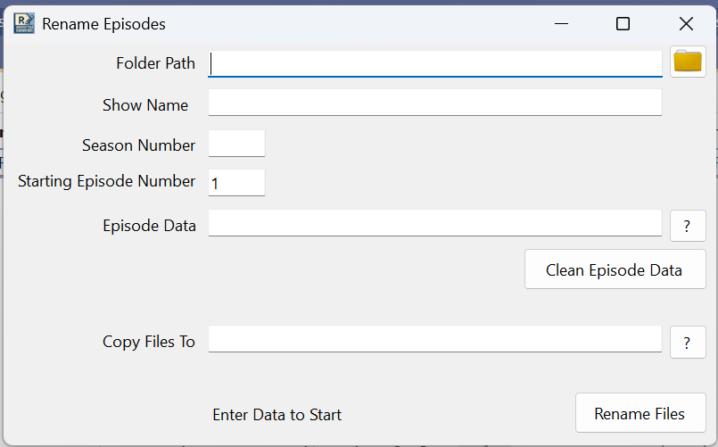
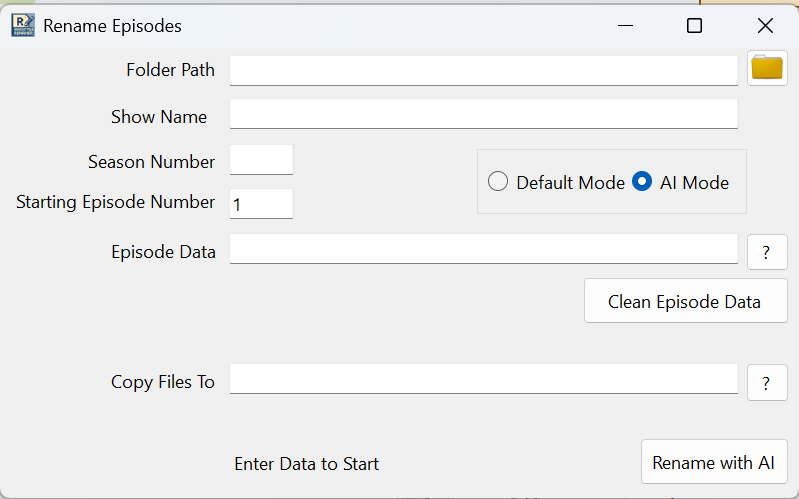

# Ansos' Episode File Renamer

This tools renames batches of files for a specific TV show, based on data from [TheTVDB.com](https://www.thetvdb.com/), including the episode title.

It is specifically designed for users of tools like Plex or Embi who are making backups of TV shows from DVDs or Blu-Rays.

## Default Mode



### Options

- Folder Path - folder where the files are now. Use the '?' button to select from a dialog.
- Season Number - number of the season you are renaming. Numbers only.
- Starting Episode Number - first episode found in the folder, will auto-increment to the 'next' episode number after the folder is completed.
- Episode Data - a text file of data copied from theTVDB.com for the season containing all the episodes one per line. Use the '?' button to select from a dialog.
  > If you copy the table into a text file from theTVDB.com season page, you can use the 'Clean Episode Data' button to should clean it up for use
- Show Name - Where the show name goes that will be used in the filename
- Copy Files To [Optional, Experimental] - Will try and copy the files to a destination location if filled. Use the '?' button to select from a dialog.

### Caveats

- Paths should **not** be wrapped in quotes
- It assumes the Folder Path **ONLY** has episodes in it, so be aware of that
  - It orders the files by creation timestamp and does its thing
- Overwrites any existing filenames
  
### Renaming

- Click the 'Rename Files' button to fire it off
  - Files will be renamed in the format `<Show Name>.S<Season Number>E<Episode Number>.<Episode Title [from Episode Data]>.<Original File Extension>`
  - for example: `Star Trek - Deep Space Nine.S03E11.Past Tense, Part I.mkv`
- The 'Undo Rename' button will revert the renames if a mistake was made. It will appear once you have renamed files.

## AI Mode

AI Mode is a experimental mode, hidden by default, that uses the season and episode number in a filename to automatically retrieve episode titles from theTVDB.com.


> To enable the AI mode toggle, you will need:
>
> 1. [an OpenAI API Key](https://platform.openai.com/docs/quickstart?desktop-os=windows)
> 2. A `secrets.json` file in the root directory with the OpenAI API Key

`secrets.json` example

``` json
{
    "OpenAI:ApiKey": "<OpenAI_API_Key>"
}
```

### Options

- Folder Path - folder where the files are now. Use the '?' button to select from a dialog.
- Show Name - The show name goes that will be used in the filename.

### Caveats

- Overwrites any existing filenames
- The AI doesn't get the episode title 100% correct yet.

### Renaming

- Click the 'Rename with AI' button to fire it off
  - Files will be renamed in the format `<Show Name>.S<Season Number>E<Episode Number>.<Episode Title [from Episode Data]>.<Original File Extension>`
  - for example: `Star Trek - Deep Space Nine.S03E11.Past Tense, Part I.mkv`
- The 'Undo Rename' button will revert the renames if a mistake was made. It will appear once you have renamed files.